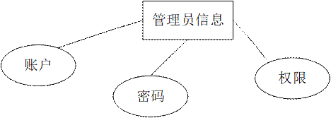

# XianYu-Store
## 基于Django的二手咸鱼系统
# 一、前言论
目前移动互联网大行其道，人人都手中拿着智能手机，如果开发一个用在手机上的程序软件，那是多么的符合潮流，符合管理者和客户的理想。本课题就是开发一个基于微信小程序的校园二手物品交易平台，有管理员和学生两个角色。管理员可以在后台管理个人中心，学生管理，商品分类管理，商品信息管理，购买信息管理，出售信息管理，交流论坛，系统管理。学生可以注册登录，发布和购买商品，还可以收藏商品和在交流论坛发帖。
本基于微信小程序的校园二手物品交易平台服务端用Java开发的网站后台，接收并且处理微信小程序端传入的json数据，数据库用到了MySQL数据库作为数据的存储。这样就让用户用着方便快捷，都通过同一个后台进行业务处理，而后台又可以根据并发量做好部署，用硬件和软件进行协作，满足于数据的交互式处理，让用户的数据存储更安全，得到数据更方便。

# 二.技术环境
jdk版本：1.8 及以上 
ide工具：Eclipse或者 IDEA，微信小程序开发工具 
数据库: mysql5.7 （必须5.7） 
编程语言: Java 
java框架：SSM 
maven: 3.6.1 
详细技术：HTML+CSS+JAVA+Django+SSM+MYSQL+VUE+MAVEN+微信开发工具

# 三.功能设计
本次开发的微信小程序的校园咸鱼版二手物品交易平台，有管理员和学生两个角色。管理员可以在后台管理个人中心，学生管理，商品分类管理，商品信息管理，购买信息管理，出售信息管理，交流论坛管理，系统管理。学生可以注册登录，发布和购买商品，还可以收藏商品和在交流论坛发帖。
系统功能结构图如下所示： 

# 四.数据设计
概念模型的设计是为了抽象真实世界的信息，并对信息世界进行建模。它是数据库设计的强大工具。数据库概念模型设计可以通过E-R图描述现实世界的概念模型。系统的E-R图显示了系统中实体之间的链接。而且Mysql数据库是自我保护能力比较强的数据库，下图主要是对数据库实体的E-R图。 
 
 
 
 

# 五.部分效果展示
# 小程序端-用户功能效果
# 5.1 首页功能
微信小程序输入正确的账号密码后就会默认进入首页显示界面。首页主要有轮播图，搜索框，以及下面的导航为主要组成部分。
 
# 5.2 商品推荐与分类功能
商品信息为基本的功能，商品信息可以分为不同的分类进行展示并会推荐每日商品，对于商品信息的展示以图片展示为主，可以使用户更加的一目了然，商品信息展示的实现界面。
 
# 5.3商品收藏功能的设计实现
在商品详情功能里，用户可以把商品进行收藏，收藏时会提示“是否收藏”。商品收藏功能的设计界面如下图所示：
 
# 5.4商品购买功能的设计实现
用户购买商品后可以查询购买信息，可以进行付款。商品购买管理功能的界面实现如下图所示：
 
# 5.5商品评价功能模块的设计实现
本功能的设计可以帮助用户评价商品，在线评价功能的实现界面如下图所示:
 

